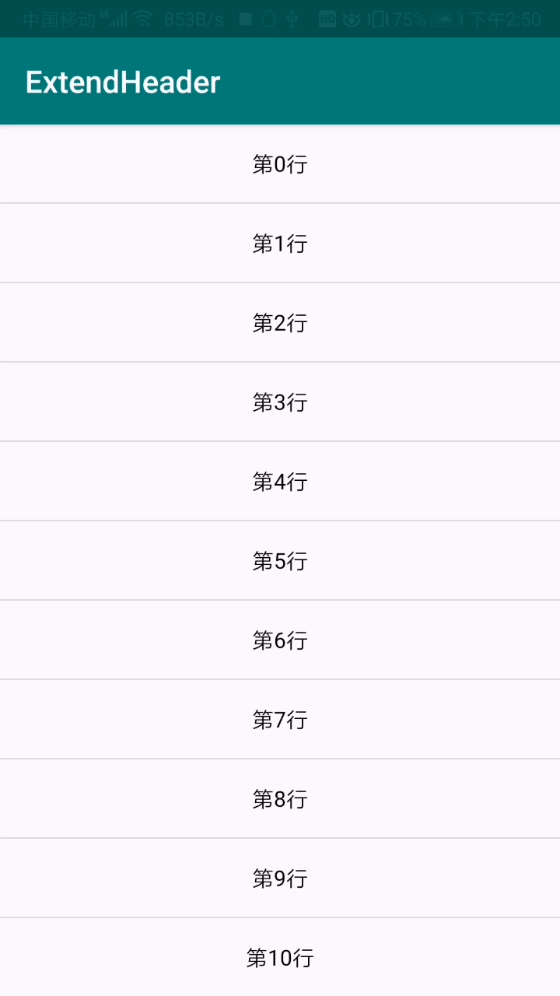

ExtendHeader
===============

Imitate WeChat and qq home page to show the style of the applet list.
模仿微信以及qq首页下拉展示小程序列表的样式

核心实现是在PullExtendLayout控件里面onInterceptTouchEvent方法判断是否传递事件，
在onTouchEvent处理事件通过pullHeaderLayout方法展示头部，其中SmoothScrollRunnable为了使
滑动能够顺畅，在ExtendListView的dispatchTouchEvent处理分发事件可以通过getParent().requestDisallowInterceptTouchEvent
设置是否拦截相关事件，具体getParent()几次需要看布局嵌套的层数。

具体实现请看代码！

QQ效果
------

模仿效果
-----

License
-------

    Copyright 2019 CaoKai-Beyond

    Licensed under the Apache License, Version 2.0 (the "License");
    you may not use this file except in compliance with the License.
    You may obtain a copy of the License at

        http://www.apache.org/licenses/LICENSE-2.0

    Unless required by applicable law or agreed to in writing, software
    distributed under the License is distributed on an "AS IS" BASIS,
    WITHOUT WARRANTIES OR CONDITIONS OF ANY KIND, either express or implied.
    See the License for the specific language governing permissions and
    limitations under the License.
